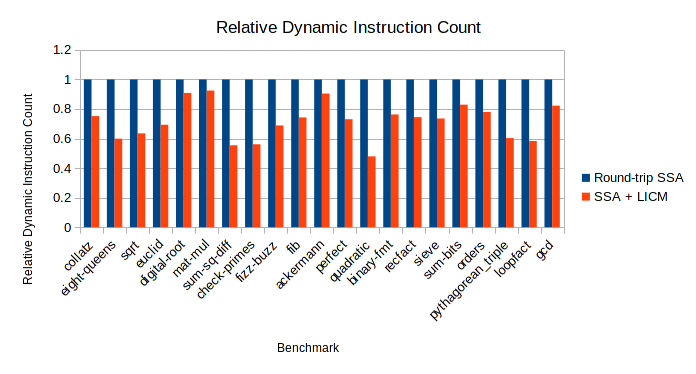

# Loop Invariant Code Motion

I implemented LICM for Bril using SSA form. The use of SSA simplified a lot of
the algorithm discussed in Lesson 5. One thing I didn't implement, which is
perhaps slightly incorrect, is checking if the destination is dead outside the
loop. Prematurely defining a side-effect-free variable is not very harmful in
SSA form, but what could happen is without the LICM, an error could be raised
from using the undefined variable, while this error might not be raised with
LICM.

A major challenge of implementing LICM in SSA form was what to do with the phi
nodes when a preheader is added. A phi node in the loop header could refer to
labels coming from both inside and outside the loop. In this case, it needs to
be split into one phi node in the preheader which handles incoming blocks from
outside the loop, and a second phi node in the loop header handling incoming
blocks from either the preheader or inside the loop.

Right now, there is a major bug in the implementation, which surprisingly
preserves correctness on the benchmarks, but is nontheless problematic. The way
I form the natural loop includes all blocks dominated by the loop. In other
words, I don't compute the *minimal* set including the backedge such that every
element is either the loop header or has all predecessors in the loop.

## Evaluation

This chart shows the change in dynamic instruction count between the
"round-trip SSA" and my LICM optimization. The reason I use round-trip SSA as
my baseline is because LICM basically is round-trip SSA plus the actual LICM
optimization. My round-trip SSA performs quite poorly, most likely because I
don't follow it with any copy propagation or dead code elimination, but this
chart isolates the effect of LICM.
